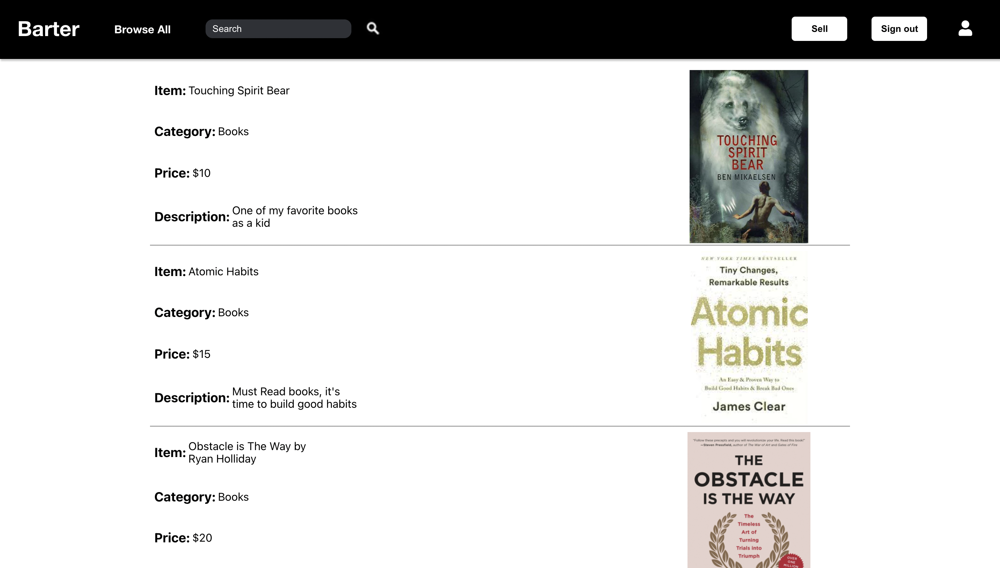
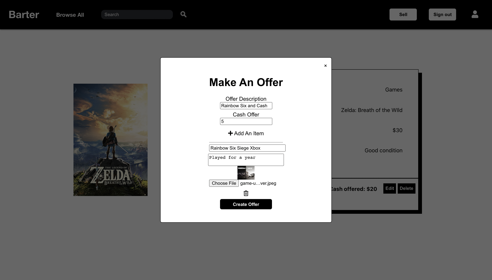
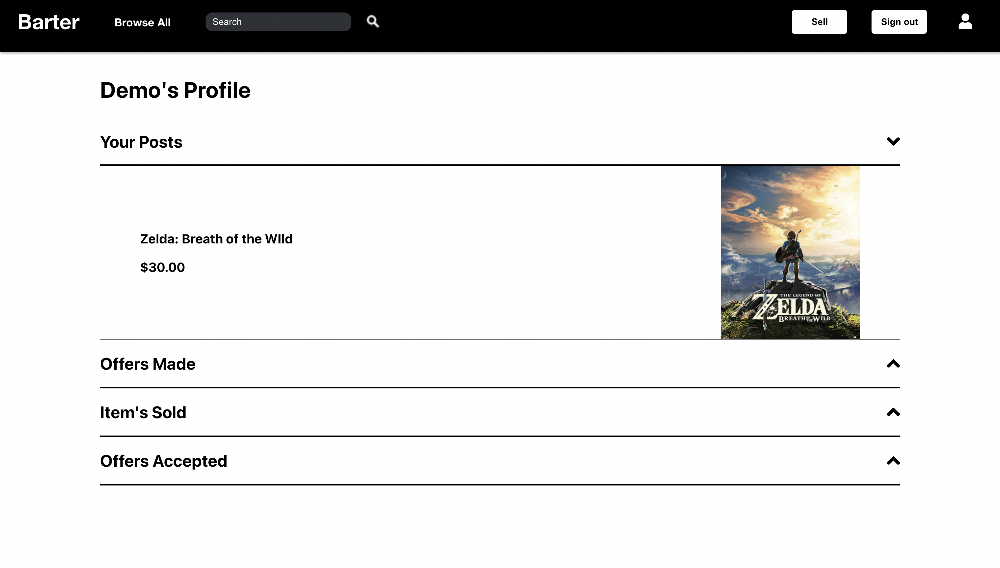

# Barter
## Live Link 
https://barter-mern.herokuapp.com/#/

## Team Members
* [Sam Jeon](https://github.com/bjeon123)
* [Jonathan Wong](https://github.com/jay5375)
* [Long Chen](https://github.com/rinayumiho)

## Overview
Barter is an ecommerce website that allows users to either trade or buy items that other users post as well as post their own items. A motivation for creating the website was for users to get more value out of their used items where they otherwise couldn't. For example people that trade games back to GameStop are given significantly less cash than what was paid for the game. Another motivation was to prevent meetups for trading items such as shoes, which is very typical in NYC and can often be dangerous as many times the people trading are usually complete strangers met on a listing board. The three categories that are present in the website are games, books, and shoes.


## Technologies
* MongoDB
* Express
* NodeJS
* ReactJS
* Cloudinary API

## Features
### Search
Users can browse through all posts or search for posts based on category or item name

### Posts
Users that are signed in and viewing their own posts can delete their post or accept and decline offers on their posts. Signed in users can also make offers on other listings. These offers can be eddited or deleted if the user that created the offer feels that they are offering too much, too little, or would like to take the offer back. 

### Profile
Signed in users on their profile page can view thier posts made, offers made, offers accepted, and items sold. Items sold and offers accepted are the most recent transactions and are limited to 3 shown per dropdown.


## Featured Code 
Editting offers inside of posts required a significant amount of logic. When people edit their offers we needed to make sure that the form that they editted didn't have errors in the any areas of the form before submitting any requests to the backend. We implemented a queue in order to do so. If people deleted items in their post we pushed those items into a queue that only made a request once it was shown that the form had no errors in the offer being editted as well as any items that exist in the offer. We also had to implement many async/await functions in order to make sure the logic of the code had a strict direction.
```javascript
handleEditSubmit(e){
        e.preventDefault();
        const updatedOffer = {
            id: this.state.editingOfferId,
            user: this.props.currentUser.id,
            text: this.state.text,
            receiver: this.props.post.data.userId,
            price: parseInt(this.state.price),
            postId: this.props.post.data._id
        }
        this.props.updateOffer(updatedOffer).then(
            (offer)=> {
                if(!offer.errors){
                    const offerData = offer.offer.data;
                    let offerWithItems = {
                        userId: this.props.currentUser.id,
                        cash: offerData.price,
                        offer_description: offerData.text,
                        offerId: offerData._id,
                        items: []
                    };
                    return offerWithItems
                }
            }
        ).then(
            async (offerWithItems)=> {
            let hasErrors= false;
                if(offerWithItems !== undefined){
                    let offer = Object.assign({}, offerWithItems)
                    for (let i = 0; i < this.state.items.length; i++) {
                        const item = this.state.items[i];
                        if (item !== null) {
                            const itemFormatted = {
                                userId: this.props.currentUser.id,
                                offerId: offerWithItems.offerId,
                                name: item.name,
                                description: item.description,
                                imageUrl: item.imageUrl
                            }
                            if (item.id) {
                                const itemResult = await this.props.updateItem(item.id, itemFormatted)
                                if (!itemResult.errors) {
                                    offer.items.push(itemResult.item.data)
                                }
                                else {
                                    hasErrors = true;
                                    break;
                                }
                            }
                            else {
                                const itemResult = await this.props.createItem(itemFormatted)
                                if (!itemResult.errors) {
                                    offer.items.push(itemResult.item.data)
                                }
                                else {
                                    hasErrors = true;
                                    break;
                                }
                            }
                        }
                    }
                    if(!hasErrors){
                        for (let i = 0; i < this.state.deleteItemQueue.length; i++) {
                            deleteItem(this.state.deleteItemQueue[i])
                        }
                        let offersDataCopy = [...this.state.offersData]
                        for (let i = 0; i < offersDataCopy.length; i++) {
                            if (offersDataCopy[i].offerId === this.state.editingOfferId) {
                                offersDataCopy[i] = offer;
                                break;
                            }
                        }
                        this.setState({ offersData: offersDataCopy, modal: [false, null], items: [], itemsToRender: [], deleteItemQueue: [] })
                    }
                }
            }
        )
    }
```
