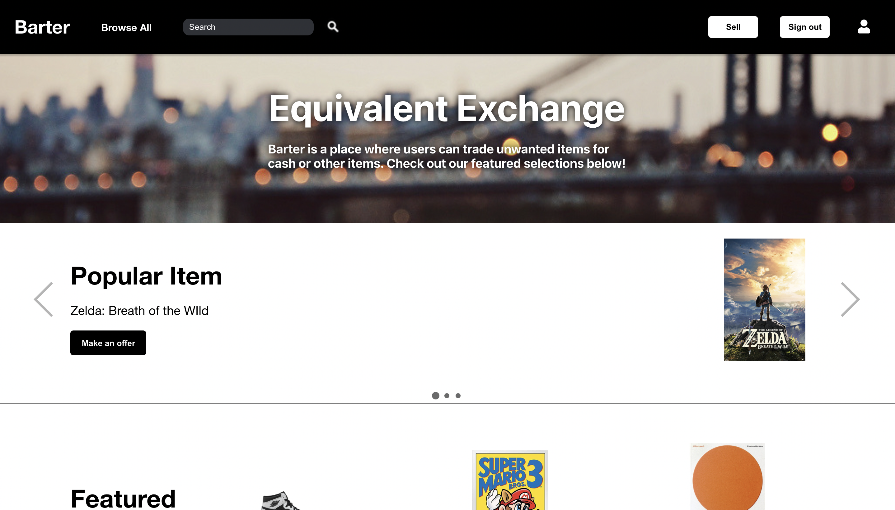

# Barter
## Live Link 
https://barter-mern.herokuapp.com/#/

## Team Members
* Sam Jeon
* Jonathan Wong
* Long Chen

## Overview
Barter is an ecommerce website that allows users to either trade or buy items that other users post as well as post their own items. A motivation for creating the website was for users to get more value out of their used items where they otherwise couldn't. For example people that trade games back to GameStop are given significantly less cash than what was paid for the game. Another motivation was to prevent meetups for trading items such as shoes, which is very typical in NYC and can often be dangerous as many times the people trading are usually complete strangers met on a listing board. The three categories that are present in the website are games, books, and shoes.

## Technologies
* MongoDB
* Express
* NodeJS
* ReactJS
* Cloudinary API

## Feautures

